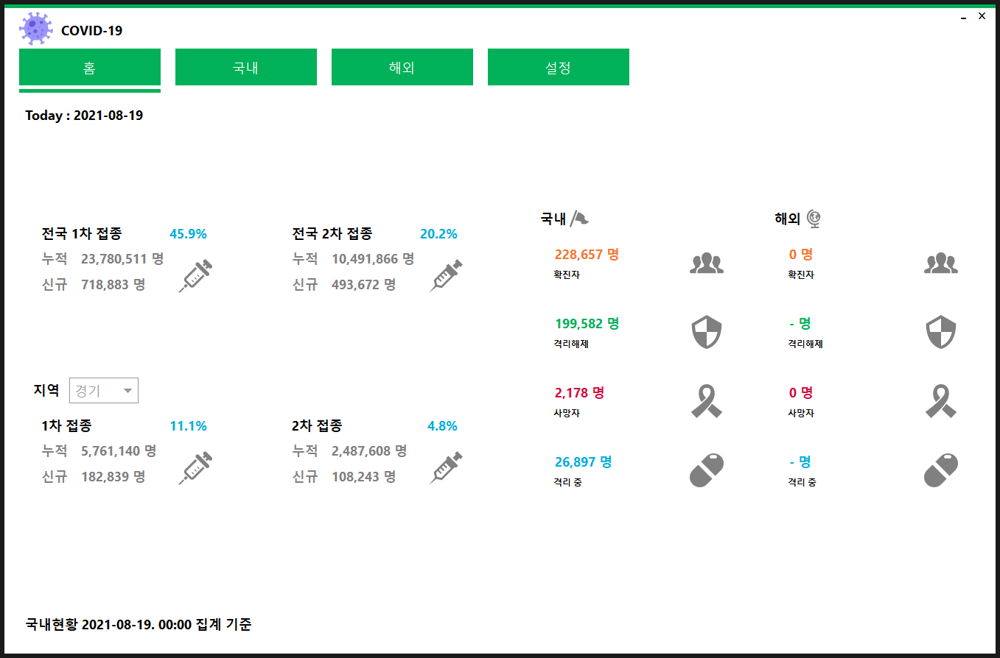
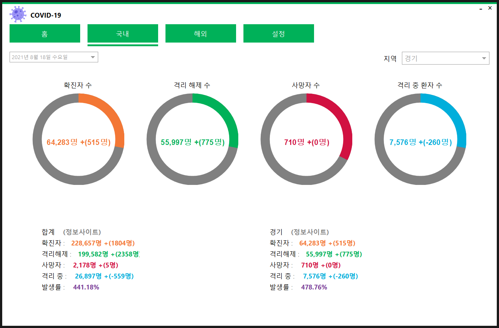
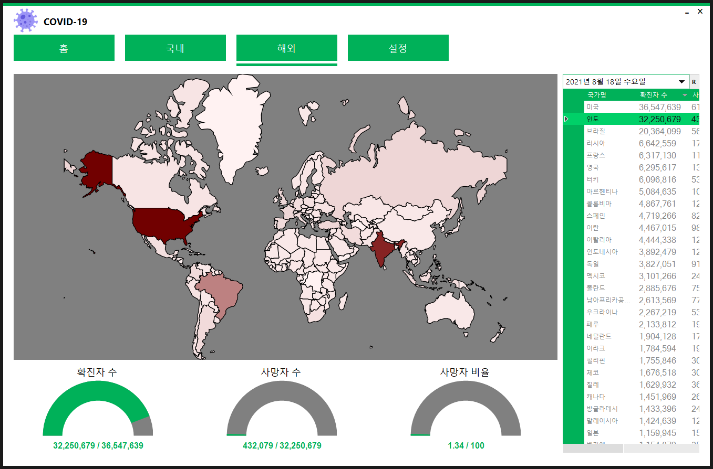
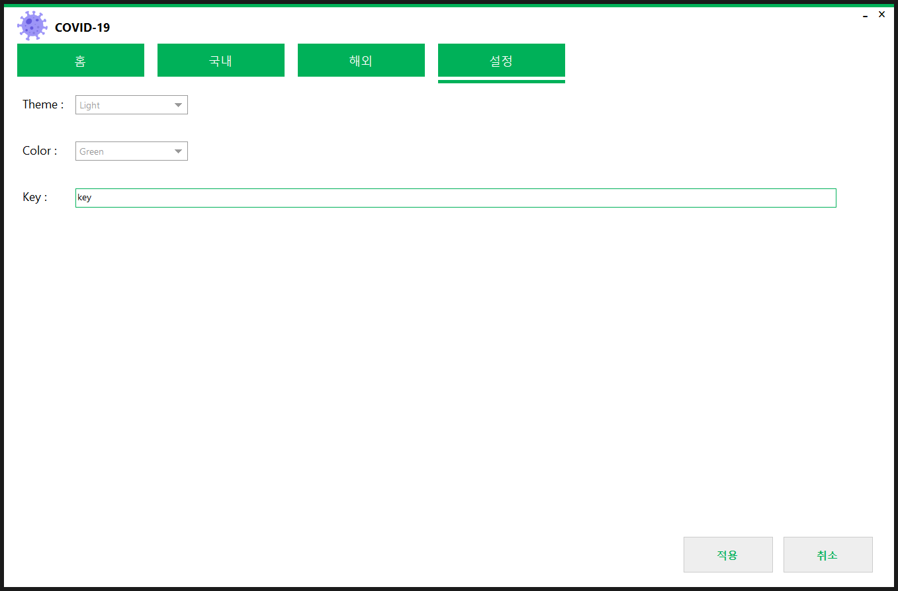

---
### C# IHChan
##### 환경 : `Visual Studio 2017`, `Windows 10`, `SQLite`, `.Net Framework 4.5`
##### Library : `MetroFramework`, `LiveCharts`, `Newtonsoft.Json`, `YamlDotnet`
---

#### 홈
- 국내 및 해외 통계

---

#### 국내
- 국내 현황

---

#### 해외
- 해외 현황

---

#### 설정
- 어플리케이션 색상 및 공공데이터 API 설정

---